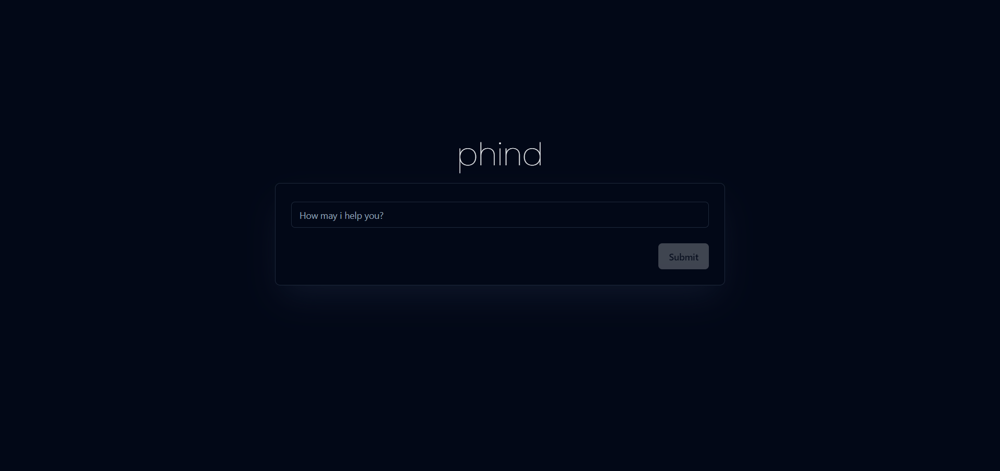
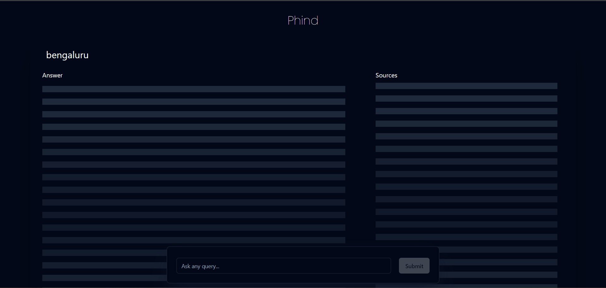

# Phind (Clone)

A simple phind clone built as a part of a Full Stack Assesment. The app revolves around sending queries to the vector database and storing the queries and responses in a database.

## Tech Stack

### 1. NextJS + FastAPI
NextJS is used for the frontend. Here the FastAPI servers are used as Python serverless functions in NextJS.

### 2. ShadCN and Tailwind CSS
ShadCN is a component library, and Tailwind CSS for seemless reponsive design.

### 3. Qdrant, OpenAI, MongoDB 
The vector database used is Qdrant, and OpenAI is used for embeddings, MongoDB is used to store the conversations

## Setup and Installation

To set up this project locally, follow these steps:

1. Cloning the repository to your local machine
 ```bash
   git clone https://github.com/Rahul-Baradol/phind-clone
   ```

2. Go to the folder named phind-clone and install the dependencies:
```bash
  cd phind-clone
  npm install
```

3. Run the development server:
```bash
  npm run dev
```

#### Note: 
Here the Nextjs and FastAPI servers run concurrently. When <code>npm run dev</code> is run, necessary python packages will also be installed. The required python packages could be found in **requirements.txt**

Also make sure to rename the file .env.template to .env.local and give the following api keys
<code>QDRANT_CLOUD_ENDPOINT</code>
<code>QDRANT_API_KEY</code>
<code>OPENAI_API_KEY</code>
<code>MONGODB_URI</code>

## Demo


